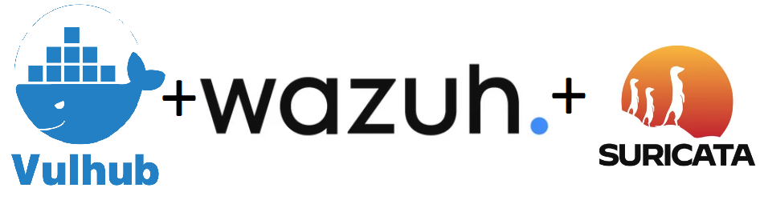

# README

<figure><figcaption></figcaption></figure>

Данный репозиторий содержит в себе инструкции по эксплуатации уязвимостей различных сервисов.

К репозиторию прилагается готовый [образ диска](https://disk.yandex.ru/d/iMNWZ4ETrjLUEg) с полным репозиторием [vulhub](https://github.com/vulhub/vulhub?ysclid=lpwf56e544559765125).

В качестве SIEM-системы используется open-sourse система - Wazuh, подробнее о системе можно узнать [здесь](https://wazuh.com), дополнительно к ней настроена IDS  [Suricata](https://suricata.io/).

Инструкция по настройке стенда: [https://gist.github.com/frizzymonsta/c68659970b1f8a222c15e1da68a0ec03](https://gist.github.com/frizzymonsta/c68659970b1f8a222c15e1da68a0ec03)

Данный репозиторий имеет неполный список инструкций, в дальнейшем он будет пополняться.

Пароли для доступа к Wazuh и к машине [здесь](https://github.com/ZHIRspb/project/blob/main/accesses.txt)

P.S Если не работает сеть, измените название интерфейса в файле `/etc/netplan/00-installer-config.yaml` на действительный и перезапустите машину

Приятного хакинга!
