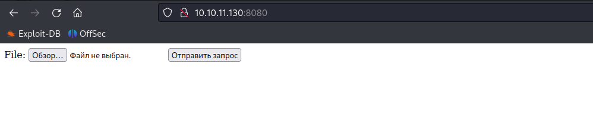
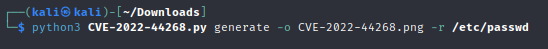
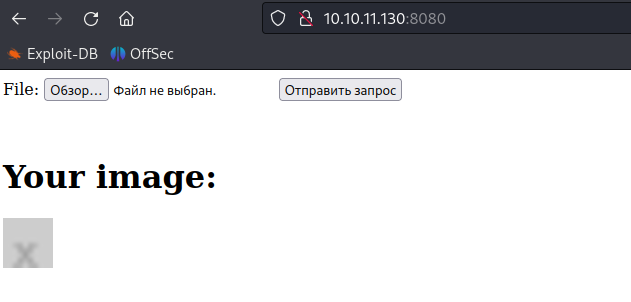
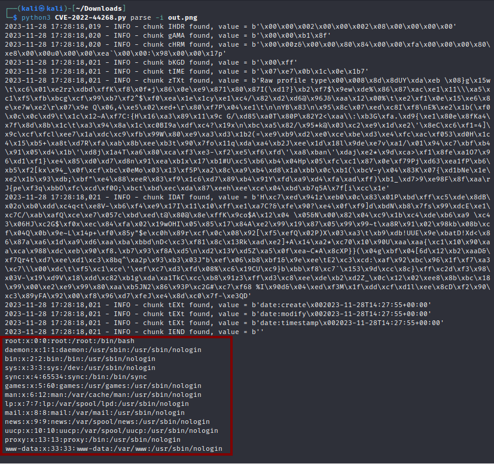
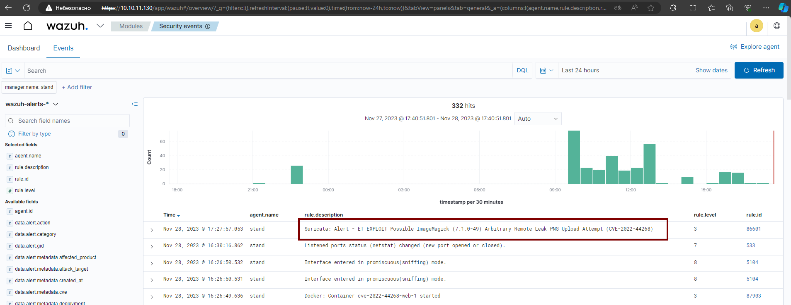

# CVE-2022-44268

### Материалы:

* [https://nvd.nist.gov/vuln/detail/CVE-2022-44268](https://nvd.nist.gov/vuln/detail/CVE-2022-44268)
* [https://www.opencve.io/cve/CVE-2022-44268](https://www.opencve.io/cve/CVE-2022-44268)

ImageMagick — это широкий набор инструментов для обработки изображений, многие производители называют эту программу для обработки изображений, включая масштабирование, обрезку, установку водяных знаков, преобразование формата и многого другого.

В версии ImageMagick до 7.1.0-51 существует уязвимость раскрытия информации, которую можно использовать для чтения произвольного файла при изменении .png файла

### Эксплуатация уязвимости

Для запуска web-сервера с ImageMagick, выполните команду:

```
docker compose up -d
```

После старта сервера по адресу http://ваш-ip:8080/ будет доступна страница с загрузкой файлов

<figure><figcaption></figcaption></figure>

Чтобы реализовать данную уязвимость, необходимо создать .png файл с помощью [скрипта](https://github.com/vulhub/vulhub/blob/master/imagemagick/CVE-2022-44268/poc.py), содержащий данные с путем до файла, который вы хотите прочитать

<figure><figcaption></figcaption></figure>

```
python3 CVE-2022-44268.py generate -o CVE-2022-44268.png -r /etc/passwd
```

Далее нужно загрузить созданный .png файл на сервер, а затем скачать картинку обратно

<figure><figcaption></figcaption></figure>

С помощью того же скрипта мы можем извлечь полученные данные, а именно, содержимое файла /etc/passwd

```
python3 CVE-2022-44268.py parse -i out.png  
```

<figure><figcaption></figcaption></figure>

В Wazuh (https://ваш-ip/app/wazuh) мы можем увидеть соответствующие алерты от IDS Suricata об эксплуатации данной уязвимости.

<figure><figcaption></figcaption></figure>
