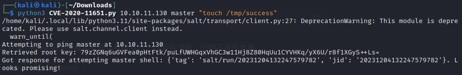
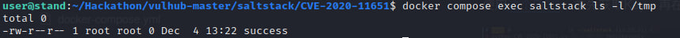
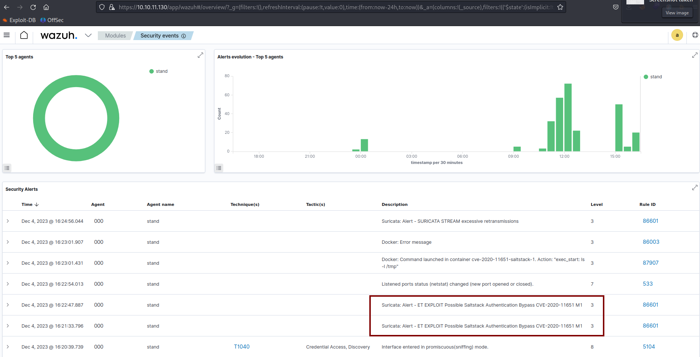

# CVE-2020-11651

### Материалы:

* [https://www.opencve.io/cve/CVE-2020-11651](https://www.opencve.io/cve/CVE-2020-11651)
* [https://nvd.nist.gov/vuln/detail/CVE-2020-11651](https://nvd.nist.gov/vuln/detail/CVE-2020-11651)

Уязвимость была обнаружена в SaltStack Salt в версиях до 2019.2.4 и с 3000 до 3000.2. Класс ClearFuncs процесса salt-master неправильно проверяет вызовы методов. Это позволяет удаленному пользователю получить доступ к некоторым методам без аутентификации. Эти методы можно использовать для получения пользовательских токенов или запуска произвольных команд.

### Эксплуатация уязвимости

> Контейнер с уязвимой средой находится в директории /home/user/Hackathon/vulhub-master/saltstack/CVE-2020-11651

Для запуска уязвимой среды выполните команду:

```
docker compose up -d 
```

Используя этот [эскплойт](https://github.com/dozernz/cve-2020-11651/blob/master/CVE-2020-11651.py), вы можете получить ключи всех пользователей. Используя этот ключ, вы можете выполнять некоторые фоновые функции с помощью привилегий суперпользователя, такие как выдача задач.

> Перед эксплуатацией вам нужно установить pip3 и библиотеку salt на атакующей машине с помощью команды `pip3 install salt`

Выполните команду `python3 CVE-2020-11651.py 10.10.11.130 master "touch /tmp/success"` для эксплуатации уязвимости

<figure><figcaption></figcaption></figure>

После её выполнения на целевой машине был создан файл /tmp/success

<figure><figcaption></figcaption></figure>

В Wazuh (https://ваш-ip/app/wazuh) мы можем увидеть соответствующие алерты от IDS Suricata об эксплуатации данной уязвимости.

<figure><figcaption></figcaption></figure>
