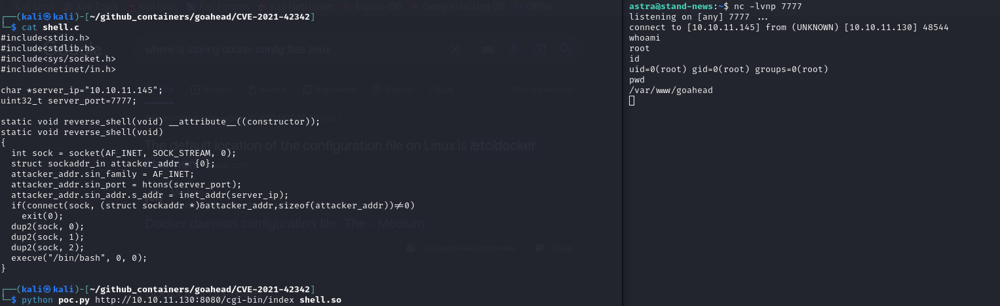

# CVE-2022-24706

### Материалы:

* [https://cve.mitre.org/cgi-bin/cvename.cgi?name=CVE-2022-24706](https://cve.mitre.org/cgi-bin/cvename.cgi?name=CVE-2022-24706)
* [https://nvd.nist.gov/vuln/detail/CVE-2022-24706](https://nvd.nist.gov/vuln/detail/CVE-2022-24706)
* [https://habr.com/ru/articles/661195/](https://habr.com/ru/articles/661195/)

Apache CouchDB написана на языке Erlang и поэтому имеет встроенную поддержку распределенных вычислений (кластеризации). Взаимодействие узлов кластера осуществляется с помощью протокола Erlang/OTP Distribution Protocol, который обеспечивает возможность выполнения командных запросов ОС от имени пользователя, запускающего программу.

Для подключения и выполнения команд ОС необходимо знать секретную фразу или, в терминах Erlang, "cookie". Программа установки CouchDB в версиях 3.2.1 и ниже по умолчанию устанавливает cookie на "monster".

Из-за недостатков в стандартной конфигурации установки CouchDB неавторизованный удаленный злоумышленник может получить доступ к определенному порту, обойти проверку прав и получить привилегии администратора, в итоге захватив сервер.

### Эксплуатация уязвимости

> Контейнер с уязвимой средой находится в директории /home/user/Hackathon/vulhub-master/couchdb/CVE-2022-24706

Для запуска уязвимой среды выполните команду:&#x20;

```
docker compose up -d
```

После запуска будут на вашей машине будут прослушиваться 3 порта:

* 5984: Веб-интерфейс для Apache CouchDB
* 4369: Служба epmd
* 9100: порт для кластерных операций и интроспекции во время выполнения (команда фактически выполняется через этот порт)

На практике порт веб-интерфейса и службы epmd фиксирован, порт кластерной операции произволен. Мы можем обратиться к службе EPMD, чтобы получить номер порта кластерной операции.

<figure><figcaption></figcaption></figure>

Для эксплуатации уязвимости вы можете использовать[ данный](https://github.com/vulhub/vulhub/blob/master/couchdb/CVE-2022-24706/poc.py) скрипт, который сначала получает порт кластерной операции от службы empd, а затем использует cookie по умолчанию для выполнения произвольных команд в кластерах

<figure><figcaption></figcaption></figure>

В Wazuh мы можем увидеть соответствующие алерты о вызове Erlang Port Mapper Daemon и о выводе результата выполнения команды id

<figure><figcaption></figcaption></figure>
